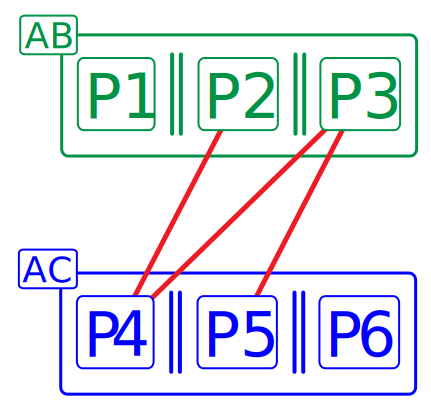

% Nor: A Lightweight and Functional Version-Control System
% Matthew Russell, JC, Hashem Nasarat
% December 5, 2012

## Introduction
* Academic literature leaves much to be desired

* State-of-the-art VCS haven't solved all the problems

* Hypothesis : Implementing a version control system will provide insight into the dificulties of rebase and merge

## Overview
#. Problems in Git

#. Representing Changes to Files

#. Conflicts

#. Rebase & Merge

#. Demo

## Is Git Crazy?

* 

* 

## Git is Crazy.

* Why is this so complex?  (300k lines of B P C)

* What strategies yield simplification?

* These questions are what we're trying to answer by building nor.

    * Representation of changes to files can simplify conflict detection & resolution
    * Simplify the problem of conflict detection and resolution.

## Nor
* Lightweight command line version control system

* Written in Haskell (~750 lines)

* State-based repository 

    * Associated with each commit is a snapshot of the filesystem

* Similar command-line usage as Git

## Basic Diff
* Need to know how to get from one state to another

* Standard diff algorithm produces an Edit for each line

* ~~~~~~ {.haskell}
data Edit = C -- Copy current input line to output
          | I String -- Insert argument line into output
          | D String -- Delete current input line which must match
~~~~~~

## Nor - Patch
* Break up edits
    * see which changes can be applied smoothly
    * which changes might interefere with others

* Patch := Path + PatchAction

* ~~~~~~ {.haskell}
data PatchAction = RemoveEmptyFile
                 | CreateEmptyFile
                 | ChangeHunk { offset :: Int -- Starting Line Number
                              , old :: [String] -- List of old lines
                              , new :: [String] -- List of new lines
                              }
~~~~~~

## Patches: Parallel vs Sequential

* Does a group of patches reference a single point in time?

* Parallel patches - set of patches referencing a common state

* Sequential patches - sequence of patches whose state referenced depends on
  the application of the previous patches.

* Isomorphism?

* Only sequential patches can be applied

* Why parallel at all?

## Conflicts

* Conflict detection is easy between two sets of parallel patches

* 

* Two patches confict when they modify overlapping lines in the original file

* Conflicts are more than just pairs of patches

## Conflicts

* 

## Conflict Resolution

* How to display conflicts to the user?

* no other patches modify these lines

* maximal conflict sets => single patch

* Image of "<<<< === >>>>"

## Are we there yet?
* With simple conflict detection & resolution, two things seem easy:

    * Merge
    * Rebase

* No

* Why?

## Merge or Rebase
* Either is now easy

* Rebase requires the ability to "replay" commits from a common ancestor

* Merge requires multiple parents

* Pictures

* Desired functionality is ambiguous

# Demo

## Summary

* There exist various representations of patches

    * Parallel patches allow for simple conflict set detection 
    * Sequential patches allow patches to be applied to files

* With conflict detection and resolution, rebase and merge become possible.

    * It's uncertain what the semantics are for the combination of these operations.

# Questions
